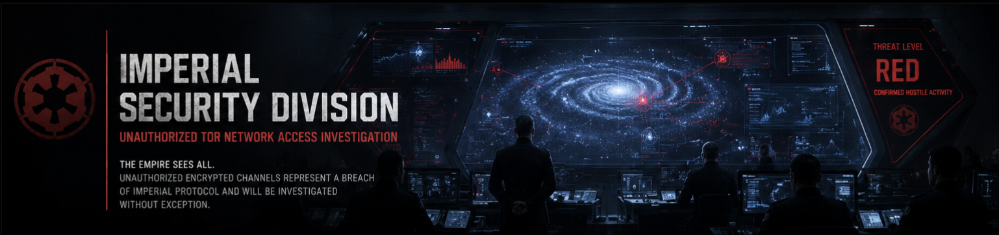

<div align="center">


</div>

---

# ⚫ Imperial Threat Investigation: Unauthorized TOR Network Access

> *"The Empire sees all. Unauthorized encrypted channels represent a breach of Imperial protocol and will be investigated without exception."*
> — Imperial Security Directive 7-Alpha

- [Imperial Scenario Setup — Event Creation Log](threat-hunting-tor-event-creation.md)

## Platforms and Languages Leveraged

- Windows 10 Virtual Machines (Microsoft Azure)
- EDR Platform: Microsoft Defender for Endpoint
- Kusto Query Language (KQL)
- TOR Browser

---

## Scenario

Imperial Command has flagged anomalous encrypted traffic patterns originating from within the Imperial network perimeter. Sector-level analysis reveals connections to known TOR entry nodes — a direct violation of Imperial communications protocol. Classified intelligence intercepts suggest certain personnel may be utilizing TOR browsers to circumvent Imperial network security controls and access restricted or unauthorized external sites during operational hours.

This investigation was initiated by Imperial Security Division to detect, confirm, and document any unauthorized TOR usage across monitored endpoints. All findings are to be treated as a **classified internal report**. Upon confirmed detection, the compromised endpoint is to be isolated and the relevant division commander notified immediately.

### High-Level TOR-Related IoC Discovery Plan

- **Scan `DeviceFileEvents`** for any `tor(.exe)` or `firefox(.exe)` file events indicating download, installation, or desktop staging of TOR components.
- **Scan `DeviceProcessEvents`** for signs of TOR browser installation execution and active process spawning.
- **Scan `DeviceNetworkEvents`** for outbound connections over known TOR relay ports (9001, 9030, 9050, 9150, 443).

---

## Steps Taken

### 1. Scanned the `DeviceFileEvents` Table

The initial sector scan targeted the `DeviceFileEvents` table, querying for any file containing the string `"tor"` on the monitored endpoint. Evidence confirmed that user `employee` on device `threat-hunt-lab` had created multiple TOR-related files on the desktop — including a file named `tor-shopping-list.txt` — and that a TOR browser installer had been staged in the Downloads directory. File creation events were first recorded at `2026-06-18T07:17:00Z`, establishing the initial compromise timestamp.

Notable files identified in this sector scan:
- `tor-shopping-list.txt` — created on the desktop
- `Tor-Browser.lnk` — shortcut created on the desktop
- `tor-launcher.txt`, `tor-browser-info` — TOR configuration artifacts
- `webappstore-sqlite`, `storage-sync-v2.sqlite` — browser storage databases indicating active usage

**Query used to locate events:**

```kql
DeviceFileEvents
| where DeviceName == "threat-hunt-lab"
| where InitiatingProcessAccountName == "employee"
| where FileName contains "tor"
| where Timestamp >= datetime(2026-06-16T07:17:00Z)
| order by Timestamp desc
| project Timestamp, DeviceName, ActionType, FileName, FolderPath, SHA256, Account = InitiatingProcessAccountName
```


---

### 2. Scanned the `DeviceProcessEvents` Table for Silent Installation

The investigation narrowed to process execution events. A targeted scan of `DeviceProcessEvents` for the TOR installer filename confirmed that user `employee` executed `tor-browser-windows-x86_64-portable-14.0.1.exe` from the Downloads directory using the `/S` silent installation flag at `2026-06-16T07:17:00Z`. The use of a silent switch is consistent with deliberate evasion of installation prompts — the subject did not want the installation to be visible.

**Query used to locate event:**

```kql
DeviceProcessEvents
| where DeviceName == "threat-hunt-lab"
| where ProcessCommandLine contains "tor-browser-windows-x86_64-portable-14.0.1.exe"
| project Timestamp, DeviceName, AccountName, ActionType, FileName, FolderPath, SHA256, ProcessCommandLine
```


---

### 3. Scanned the `DeviceProcessEvents` Table for TOR Browser Execution

With installation confirmed, the investigation advanced to verify whether the TOR browser was actively launched. The sector scan returned affirmative results: `firefox.exe` (TOR Browser's embedded browser engine) was spawned at `2026-06-16T07:17:00Z`, followed by multiple child processes. The presence of content process flags (`-contentproc -channel-442`) and process command-line arguments consistent with TOR Browser's multi-process architecture confirms active browser execution — not merely installation.

**Query used to locate events:**

```kql
DeviceProcessEvents
| where DeviceName == "threat-hunt-lab"
| where FileName has_any ("tor.exe", "firefox.exe", "tor-browser.exe")
| project Timestamp, DeviceName, AccountName, ActionType, FileName, FolderPath, SHA256, ProcessCommandLine
| order by Timestamp desc
```


---

### 4. Scanned the `DeviceNetworkEvents` Table for Active TOR Relay Connections

The final phase of the sector scan confirmed active TOR network usage. At `2026-06-16T07:18:00Z`, `tor.exe` on device `threat-hunt-lab` successfully established outbound connections to external relay infrastructure — including IP `176.198.159.33` on port `9001` (a confirmed TOR relay port) and `194.164.169.85` on port `443`. A loopback connection to `127.0.0.1` on port `9150` was also detected, consistent with TOR's local SOCKS proxy behavior that routes browser traffic through the anonymization network.

**This confirms full TOR tunnel establishment. Threat status: CONFIRMED HOSTILE ACTIVITY.**

**Query used to locate events:**

```kql
DeviceNetworkEvents
| where DeviceName == "threat-hunt-lab"
| where InitiatingProcessAccountName != "system"
| where InitiatingProcessFileName in ("tor.exe", "firefox.exe")
| where RemotePort in ("9001", "9030", "9040", "9050", "9051", "9150", "80", "443")
| project Timestamp, DeviceName, InitiatingProcessAccountName, ActionType, RemoteIP, RemotePort, RemoteUrl, InitiatingProcessFileName, InitiatingProcessFolderPath
| order by Timestamp desc
```


---

## Chronological Event Timeline

### 1. File Download — TOR Installer Staged

- **Timestamp:** `2026-06-16T07:17:00Z`
- **Event:** User `employee` downloaded the TOR browser installer to the local Downloads directory. The filename `tor-browser-windows-x86_64-portable-14.0.1.exe` confirms the specific version obtained (v14.0.1, 64-bit portable).
- **Action:** File download detected via `DeviceFileEvents`.
- **File Path:** `C:\Users\employee\Downloads\tor-browser-windows-x86_64-portable-14.0.1.exe`

### 2. Process Execution — Silent TOR Browser Installation

- **Timestamp:** `2026-06-16T07:17:00Z`
- **Event:** User `employee` executed the TOR installer with the `/S` silent flag, initiating a background installation that suppresses all user-facing prompts. This evasion technique indicates the subject had prior knowledge of the installation process.
- **Action:** Process creation detected via `DeviceProcessEvents`.
- **Command:** `tor-browser-windows-x86_64-portable-14.0.1.exe /S`
- **File Path:** `C:\Users\employee\Downloads\tor-browser-windows-x86_64-portable-14.0.1.exe`

### 3. Process Execution — TOR Browser Launched

- **Timestamp:** `2026-06-16T07:17:00Z`
- **Event:** User `employee` launched the TOR browser. Multiple child processes were spawned, including `firefox.exe` with content-process flags and channel identifiers consistent with TOR Browser's multi-process architecture. Active execution was confirmed.
- **Action:** Process creation of TOR browser-related executables detected via `DeviceProcessEvents`.
- **File Paths:**
  - `C:\Users\employee\Desktop\Tor Browser\Browser\firefox.exe`
  - `C:\Users\employee\Desktop\Tor Browser\Browser\TorBrowser\Tor\tor.exe`

### 4. Network Connection — TOR Relay Established

- **Timestamp:** `2026-06-16T07:18:00Z`
- **Event:** A successful outbound connection was established to remote IP `176.198.159.33` on port `9001` by process `tor.exe`. Port 9001 is a primary TOR relay port used for onion routing traffic. **Full TOR tunnel confirmed.**
- **Action:** `ConnectionSuccess` recorded in `DeviceNetworkEvents`.
- **Process:** `tor.exe`
- **File Path:** `C:\Users\employee\Desktop\Tor Browser\Browser\TorBrowser\Tor\tor.exe`

### 5. Additional Network Connections — Active TOR Usage

- **Timestamps:**
  - `2026-06-16T07:18:00Z` — Connected to `194.164.169.85` on port `443`.
  - `2026-06-16T07:18:00Z` — Local loopback connection to `127.0.0.1` on port `9150`.
- **Event:** Multiple additional TOR-related network connections detected. The connection to port `443` via `firefox.exe` indicates external HTTPS traffic routed through TOR. The loopback on port `9150` is the TOR SOCKS proxy port — confirming the browser was actively routing traffic through the TOR anonymization layer.
- **Action:** Multiple `ConnectionSuccess` events detected.

### 6. File Creation — TOR Activity Artifacts and Shopping List

- **Timestamp:** `2026-06-18T07:17:00Z`
- **Event:** Numerous TOR-related files were created on the user's desktop during active browser use, including `tor-shopping-list.txt`, `Tor-Browser.lnk`, and browser storage databases (`webappstore-sqlite`, `storage-sync-v2.sqlite`). The creation of `tor-shopping-list.txt` — a manually authored file — indicates the subject was documenting or planning activities conducted over TOR.
- **Action:** Multiple `FileCreated` events detected via `DeviceFileEvents`.
- **File Path:** `C:\Users\employee\Desktop\tor-shopping-list.txt`

---

## Summary

Imperial Security Division confirms: user `employee` on endpoint `threat-hunt-lab` executed a deliberate, multi-stage operation to install, launch, and actively use the TOR browser in violation of Imperial network policy. The subject employed a silent installation flag (`/S`) to minimize detection, successfully established an anonymized TOR tunnel to external relay infrastructure, and created desktop artifacts — including a file titled `tor-shopping-list.txt` — suggesting documented intent behind the TOR session.

**Threat vector:** Insider threat — deliberate evasion of network monitoring controls.

**Evidence chain:**
- ✅ Installer downloaded and staged: `tor-browser-windows-x86_64-portable-14.0.1.exe`
- ✅ Silent installation executed: `/S` flag confirmed
- ✅ TOR browser launched: `firefox.exe` + `tor.exe` process tree detected
- ✅ TOR relay connections established: IP `176.198.159.33:9001`, `194.164.169.85:443`, `127.0.0.1:9150`
- ✅ Activity artifacts created: `tor-shopping-list.txt` and browser storage files

---

## Response Taken

TOR usage was confirmed on endpoint `threat-hunt-lab` by user `employee`. The device was **isolated from the Imperial network** immediately upon threat confirmation. The user's division commander was **notified per Imperial Security Directive 7-Alpha**. All forensic evidence — scan reports, process logs, network connection records, and file artifacts — has been preserved for further investigation by Imperial Command.

---

<div align="center">

*This report is classified. Distribution limited to Imperial Security Division and authorized command personnel.*

⚫ **Imperial Security Division** | Microsoft Defender for Endpoint | KQL

</div>
